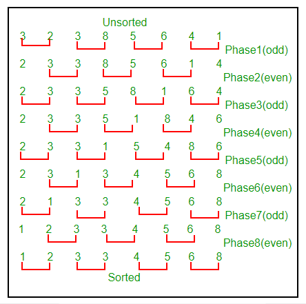
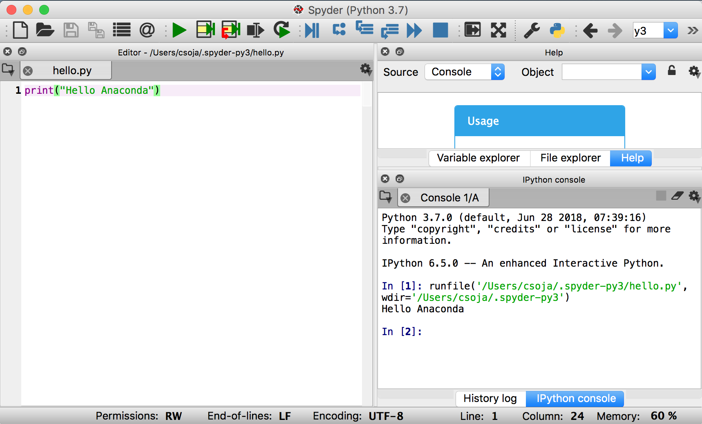

# Método ODD-EVEN SORT en Python

## ¿Qué es?

El método odd-even sort, o en español ordamiento impar-par, es un algorítmo de ordenación sencillo para arreglos y listas. Si estudias computación o te interesan los temas de programación, probablemente estás familiarizado con el bubble sort u ordenamiento burbúja. Si en tu caso lo conoces, ¡muy bien!, este método es muy parecido, de lo contrario estate tranquilo que aquí te lo explicaré con detalles. 

## Funcionamiento en palabras

Este método funciona comparando todas las parejas adyacentes, es decir elementos juntos, con indices impar/par (Ejemplo1. primero tomas el elemento 1 y 2, luego el 2 y 3  y así sucesivamente), y si el órden es incorrecto, o sea si el primer elememto de la pareja es mayor al segundo, entonces hay un reordenamiento. Y el proceso se repite ahora con índices par/impar, como en el ejemplo 1, hasta que la lista este ordenada. ¿Ahora entiendes el por qué del nombre, verdad? Te dije que estaba muy sencillo, ahora veamos cómo implementarlo.

En caso de que no me haya explicado bien, te dejo este diagrama de un ejemplo en concreto que estoy seguro te ayudará.


## Requerimientos

Como se menciona en el título, esta es una implementación en el lenguaje Python. Tú puedes utilizar el IDE de tu preferencia, si no conoces o cuentas con ninguno: [aquí](https://anaconda.org/anaconda/python) te dejo el que yo uso. Se llama Anaconda y puedes instalarlo muy fácil en cualquier sistema operativo.

Una vez instalado tu compilador de código estámos listos, si es tu primera vez programando en Python te dejo una imagen de un código de "Hola Mundo" para que vayas familiarizandote. 



Ahora si vamos a ver el código:

## Implementación en Python


```python
"""
@author: Plauchu
"""

def odd_Even_Sort (lista_valores):
    ordenado = False
    while not ordenado:
        ordenado = True
        i=0
        while i<len(lista_valores)-1:
            if lista_valores[i + 1] < lista_valores[i]:
                aux = lista_valores[i]
                lista_valores[i] = lista_valores[i + 1]
                lista_valores[i + 1] = aux
                ordenado = False
            i = i + 2
        i=1
        while i<len(lista_valores)-1:
            if lista_valores[i + 1] < lista_valores[i]:
                aux = lista_valores[i]
                lista_valores[i] = lista_valores[i + 1]
                lista_valores[i + 1] = aux
                ordenado = False
            i = i + 2
        
```

## Explicación

Definimos el método odd_Even_Sort, le damos el arreglo a ordenar y ponemos una variable bandera que nos dirá si ya está ordenado o no, es importante que este inicializada en False. Haremos dos whiles, el primero para los índices impar/ par y otro para los índices par/impar. Mientras no este ordenado y no hayamos pasado por todo el arreglo hacemos la comparación de la pareja, si es cierto se manda a una variable auxiliar el menor, y en la lista original se hace el reordenamiento, se sigue manteniendo la variable en false y se aumenta el contador i en dos valores. Saliendo de ese while pasamos al segundo, el reordenamiento es el mimsmo. Terminamos cuando hayamos recorrido toda la lista.

## Prueba


```python
arr=[3,8,5,1,-3,1,27]
print(arr)
odd_Even_Sort(arr)
print(arr)
```

    [3, 8, 5, 1, -3, 1, 27]
    [-3, 1, 1, 3, 5, 8, 27]


Como ves, ahora tu arreglo está ordando por medio del método Odd-even sort. Espero que este documento sea de tu ayuda.
