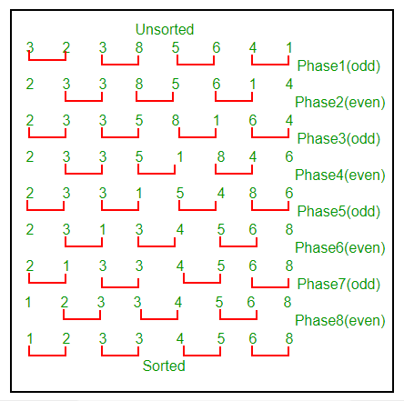

# Método ODD-EVEN SORT 

## Información general

Este repositorio es una implementación de un método que organiza arreglos y listas de maner óptima, está implementado en Python utilizando Spyder.

## ¿Qué es?

El método odd-even sort, o en español ordamiento impar-par, es un algorítmo de ordenación sencillo para arreglos y listas. Este es muy parecido a un método llamado bubble sort u ordenamiento burbuja. Sirve para ordenar de menor a mayor con una complejidad de orden cuadrado. Por lo que es eficiente para arreglos y listas no muy grandes. 


## Funcionamiento

Este método funciona comparando todas las parejas adyacentes, es decir elementos juntos, con índices impar/par, y si el órden es incorrecto, o sea si el primer elemento de la pareja es mayor al segundo, entonces hay un reordenamiento. El proceso se repite ahora con índices par/impar, hasta que la lista este ordenada. 

Observa el siguiente ejemplo:

Ejemplo1. primero tomas el elemento 1 y 2, luego el 2 y 3  y así sucesivamente

En la siguiente imagen se observa el proceso completo para un arreglo de 8 números:


## Requerimientos

Utiliza el IDE de tu preferencia. En mi caso utilice Anaconda y si quieres descargalo da click [aquí](https://anaconda.org/anaconda/python), funciona en cualquier sistema operativo.

En caso de haber eligido Anaconda, una vez instalado y abierto, es necesario seleccionar el programa de Spyder. En la siguiente foto es la última opción, es decir, el útimo recuadro en la segunda fila. 


## Implementación en Python


```python
"""
@author: Plauchu
"""

#definimos método con arreglo/lista a ordenar
def odd_Even_Sort (lista_valores):
    #bandera
    ordenado = False
    while not ordenado:
        ordenado = True
        i=0
        #Primer ciclo para índice impar 
        while i<len(lista_valores)-1:
            #comparación del elemento adyacente
            if lista_valores[i + 1] < lista_valores[i]:
                aux = lista_valores[i]
                lista_valores[i] = lista_valores[i + 1]
                lista_valores[i + 1] = aux
                #Sigue sin estar ordenado
                ordenado = False
            i = i + 2
        i=1
        #Segundo ciclo para índice par 
        while i<len(lista_valores)-1:
            #comparación del elemento adyacente
            if lista_valores[i + 1] < lista_valores[i]:
                aux = lista_valores[i]
                lista_valores[i] = lista_valores[i + 1]
                lista_valores[i + 1] = aux
                #Sigue sin estar ordenado
                ordenado = False
            i = i + 2
        
```

Consideremos un ejemplo con un arreglo de elementos [3,8,5,1,-3,1,27] el método arroja el siguiente resultado:


```python
arr=[3,8,5,1,-3,1,27]
print(arr)
odd_Even_Sort(arr)
print(arr)
```

    [3, 8, 5, 1, -3, 1, 27]
    [-3, 1, 1, 3, 5, 8, 27]

